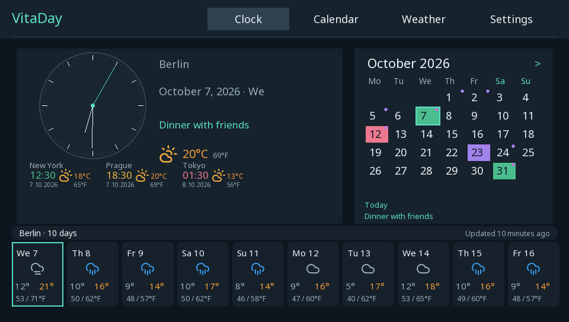

# VitaDay

A native clock, weather and calendar dashboard for PlayStation Vita. Developed and tested with VitaSDK for PS Vita 2000 running VitaShell.

[Русская инструкция и история изменений](docs/README.ru.md)



## Download and install

Download **VitaDay-0.9.6.vpk** from [Releases](https://github.com/s1zzle5486/VitaDay/releases/latest), copy it to your Vita and install with VitaShell. Updates use the same title ID, `VDAY00001`, and preserve the application's saved data in `ux0:data/VitaDay`.

Version 0.9.6 passes desktop checks and a native VitaSDK build. This specific package has not yet been tested on physical Vita hardware. The preview above is rendered on a computer.

## Features

- Three clock styles, seconds, 12/24-hour time and additional city clocks with local dates.
- Ten-day weather forecasts, hourly charts, rain, humidity, wind and two simultaneous unit systems.
- Calendar with holidays from multiple countries, Russian holiday names, personal events, colors and yearly repetition.
- Russian and English interface, city search, country-specific region and postal code fields.
- Light, dark and automatic appearance, day/night backgrounds, custom images, RGB colors and transparency.
- Touch, d-pad and analog stick navigation; system X/O button assignment; optional button hints and keeping the screen awake.

Up to **8 countries** and **16 additional cities in total**. The primary location is outside the city limit. Countries manage holidays and colors; cities manage clocks and weather.

## Controls

L/R switch the main tabs. On Home, Start changes the clock style and Select selects the clock, calendar or weather block. The left stick follows the d-pad; the right stick changes the calendar month or settings section. In the weather city list, press Right or tap the three-dot menu to manage and delete a city. Confirm and Back follow the Vita system X/O preference.

## Build

Install [VitaSDK](https://vitasdk.org/) and its `libvita2d`, `freetype`, `libpng`, `libjpeg-turbo`, `curl`, `openssl`, `zlib`, `bzip2` and `zstd` packages. Python 3 is used for package checks.

```sh
export VITASDK=/path/to/vitasdk
make -j2
```

The resulting package is `VitaDay.vpk`. LiveArea images and ELF relocations are checked during the build.

## Desktop tests

A C++17 compiler, Python 3 and libcurl development headers are required. Run from the repository root:

```sh
python3 tools/test_host.py
```

Tests cover calendar arithmetic, regional holidays, save recovery/migration, time zones, input repeat, color settings, forecast fixtures, city identity and removal, and PNG decoding. They use recorded or synthetic fixtures and do not contact the network.

## Services and third-party resources

Location: [ipwho.is](https://ipwhois.io/documentation). Weather and city search: [Open-Meteo](https://open-meteo.com/), with explicitly submitted fallback searches using [OpenStreetMap Nominatim](https://nominatim.org/). Holidays: [Nager.Date](https://date.nager.at/). Cached data remains available offline.

Data coverage and service availability vary by country. Weather is a model forecast. Personal events are stored on the Vita; no account or cloud synchronization is used.

Third-party notices and licenses are included in `assets/`, including photographs, Lucide icons, font, Unicode CLDR/IANA data, nlohmann/json, LodePNG and holiday data. See [resource notices](assets/BACKGROUNDS-LICENSE.md) and [Russian documentation](docs/README.ru.md).
