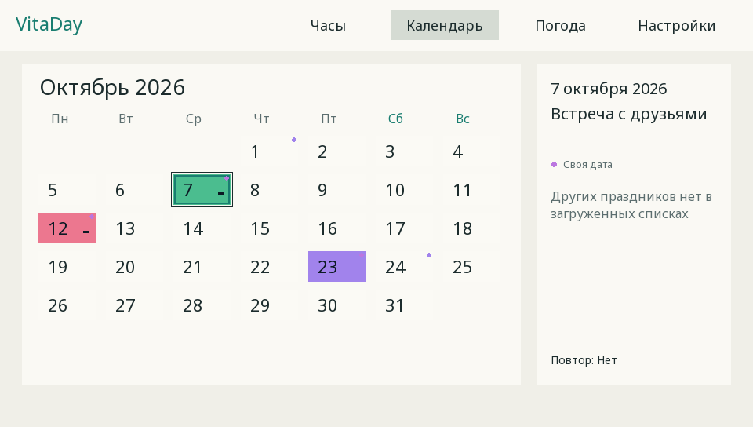
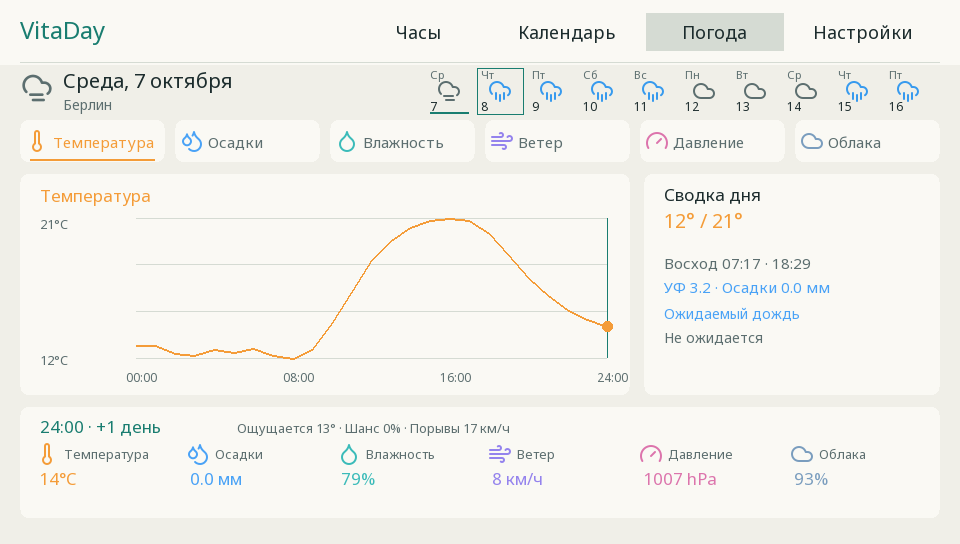
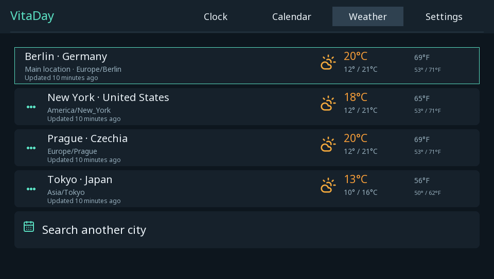
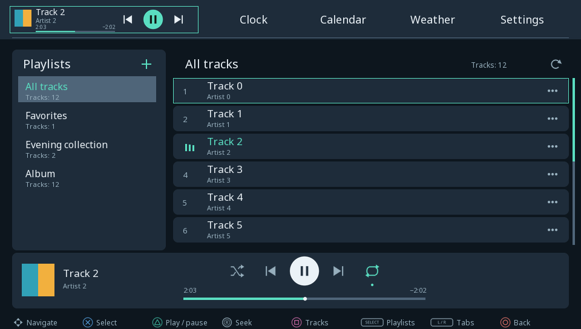
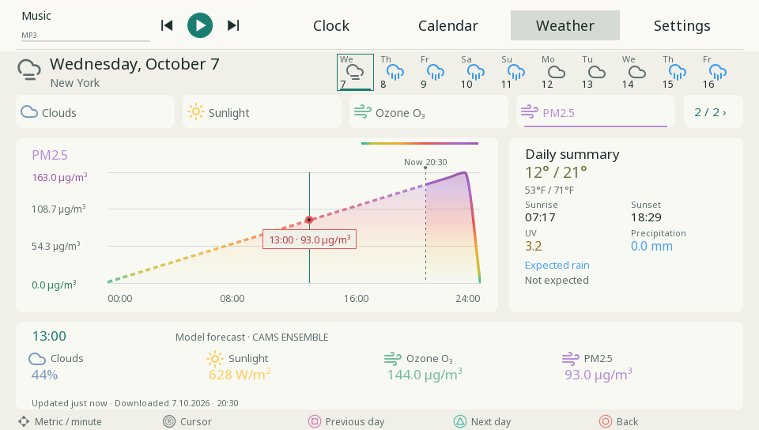

# VitaDay

A native clock, weather, calendar and local MP3 dashboard for PlayStation Vita. Built with VitaSDK for homebrew-enabled PS Vita systems, including PS Vita 2000.

[Download](https://github.com/s1zzle5486/VitaDay/releases) · [Русская инструкция](docs/README.ru.md) · [What's new in 0.10.31](docs/RELEASE-0.10.31.md)


## Install or update

Download **VitaDay-0.10.31.vpk** from [Releases](https://github.com/s1zzle5486/VitaDay/releases), copy it to your Vita and install with VitaShell. Install over the previous version to keep your settings and calendar. The title ID remains `VDAY00001`; saved data lives in `ux0:data/VitaDay/`.

Version 0.10.31 passes a native VitaSDK build and offline desktop checks. This exact build has not yet been tested on physical Vita hardware. Screenshots in this repository are desktop renders of the application UI with sample data.

## Features

- Three clock styles with seconds, 12/24-hour time, extra city clocks, local dates and current weather. Select an extra city on Home to open its weather.
- Ten-day forecasts, temperature, rain, humidity, wind, pressure, cloud-cover, sunlight, ozone and PM2.5 charts; primary and secondary unit systems.
- Smooth chart navigation with touch or the analog stick, meaningful gradient fills and dashed past segments. Minute positions interpolate the hourly forecast; they are not measured minute-by-minute weather data.
- Country and regional holidays, a selection of international observances, personal events, colors and yearly repetition. Matching holidays from several countries share one entry.
- Persistent holiday caches by country, year and region; saved weather remains available offline. Weather normally refreshes every 15 minutes while the app is open and online.
- All 20 Vita interface languages, system-language selection, and a language picker. Japanese, Chinese and Korean glyphs use the app's own bitmap renderer.
- Light, dark and automatic themes, separate day/night backgrounds, 10 built-in photographs, custom PNG/JPEG images, text/accent colors and panel transparency.
- Local MP3 playback, embedded ID3 cover art, artist tags, favorites, user playlists, shuffle and repeat, plus a Home mini-player with seeking.
- Touch, d-pad and analog controls, system X/O assignment, localized control diagrams, scroll indicators and a keep-screen-awake option.

Up to **8 tracked countries** and **16 additional cities in total**. The primary location is outside the city limit. Countries manage holidays and colors; cities manage clocks and weather. Several cities can belong to the same country.

## Controls

L/R switch the main tabs. On Home, Start changes the clock style and Select selects the clock, calendar or weather block. The left stick follows the d-pad. The right stick changes the calendar month, settings section, or weather chart cursor, depending on the screen. In the weather city list, press Right or tap the three-dot menu to manage and delete a city. Confirm and Back follow the Vita system X/O preference.

Open **Settings → General → Control layout** for the diagram in your selected language.

## Local MP3 music

Copy your own MP3 files with VitaShell to **`ux0:data/VitaDay/music/`** or **`ux0:music/`**. Open Music with L/R, then choose **Refresh** in the playlist menu or tap the refresh icon above the tracks. Folders appear as playlists; up to 256 MP3s and four nested folder levels are scanned. macOS `._` companion files and invalid MP3s are ignored.

- **SELECT** opens playlist management: create, rename, delete or refresh. **Square** or a track's three-dot menu opens track actions: favorite, add to a playlist, remove from a playlist, move up/down or delete the MP3.
- Removing a track from a playlist or deleting a playlist keeps the MP3. **Delete MP3 from card** requires confirmation and deletes the actual file and its playlist references.
- Up to 64 playlists including Favorites, with up to 256 tracks per playlist. Playlists are saved on the Vita.
- **Triangle** plays/pauses. The left stick/d-pad moves through the interface: Right from playlists opens tracks, Left returns to playlists, Down after the last item reaches playback controls. The right stick seeks. L/R always switch main tabs; previous/next-track icons control tracks.
- Shuffle and repeat use separate icons. Playlist repeat is enabled by default; turn it off to stop at the end, or choose repeat-one. The centered progress bar shows elapsed time on the left and remaining time on the right. Home has a compact player too.
- The app reads title/artist tags and embedded PNG/JPEG cover art; unsupported or absent covers use a fallback. Change volume with the Vita's physical volume buttons.

Music is local only: no streaming service, account or API key. Closing VitaDay or fully powering off stops playback. The app requests that playback remain active when Power blanks the display; this behavior still needs checking on your console.

## Weather value colors

Numbers and charts use physical-value color scales, consistent in both unit systems. Temperature runs from blue to red; wind, humidity and UV have separate scales. Text colors adapt to the panel background. Ozone and PM2.5 use the [EEA 2024 hourly concentration boundaries](https://airindex.eea.europa.eu/AQI/index.html) with continuous color transitions. These are pollutant-specific model forecasts, not a combined AQI. Missing values remain neutral. Pressure, clouds, precipitation and sunlight colors indicate magnitude rather than safety.

## Add your own background

1. Prepare a **PNG, JPG or JPEG** image. **960 × 544 pixels** is recommended; each dimension must be at most **2048 pixels**. The image fills the screen with its proportions preserved, so different aspect ratios are cropped at the edges.
2. Open VitaShell and copy the file into **`ux0:data/VitaDay/backgrounds/`**. VitaDay creates this folder after its first launch; you can also create it yourself in VitaShell. For example: `ux0:data/VitaDay/backgrounds/my-photo.jpg`.
3. Open **VitaDay → Settings → Appearance → Background**. Scroll past the built-in photographs and select your file's thumbnail using touch or the d-pad/left stick and the system Confirm button.
4. If the gallery was already open when you copied the file, press **Square** to rescan it, or close and reopen the gallery. The gallery lists up to **100 user image files**.

With **Theme → Automatic**, choose **Day background** and **Night background** separately, then set **Day begins** and **Night begins**. With Light or Dark selected, the single Background item changes the background for that theme. Adjust **Panel transparency** if you want more of the photo to show through.

## Preview

These English previews use sample data, not live weather or a console capture.









## Build

Install [VitaSDK](https://vitasdk.org/) and its `libvita2d`, `freetype`, `libpng`, `libjpeg-turbo`, `curl`, `openssl`, `zlib`, `bzip2` and `zstd` packages. Python 3 is used for package checks.

```sh
export VITASDK=/path/to/vitasdk
make -j2
```

The resulting package is `VitaDay.vpk`. LiveArea images and ELF relocations are checked during the build. Prebuilt bitmap fonts and control diagrams are included in `assets/`; regenerating them is not required to build the app.

## Desktop tests

A C++17 compiler, Python 3, libcurl development headers and zlib are required. Run from the repository root:

```sh
python3 tools/test_host.py
```

Tests run with AddressSanitizer and UndefinedBehaviorSanitizer. They cover calendar arithmetic, regional holidays and cache persistence, save migration, time zones, input repeat, smooth chart navigation, color settings, offline forecasts, localization, bitmap fonts, control diagrams, city identity/removal and image decoding. Fixtures are recorded or synthetic; tests do not contact the network.

## Services and third-party resources

Location: [ipwho.is](https://ipwhois.io/documentation). Weather and city search: [Open-Meteo](https://open-meteo.com/), with explicitly submitted fallback searches using [OpenStreetMap Nominatim](https://nominatim.org/). Air quality: Open-Meteo / [CAMS ENSEMBLE](https://ads.atmosphere.copernicus.eu/). Holidays: [Nager.Date](https://date.nager.at/). Cached data remains available offline.

Data coverage and service availability vary by country. Weather is a model forecast. Personal events are stored on the Vita; no account or cloud synchronization is used.

Third-party notices and licenses are included in `assets/`, including photographs, Lucide icons, fonts, Unicode CLDR/IANA data, nlohmann/json, LodePNG, dr_mp3 (see src/dr_mp3.h) and holiday data. See [photograph notices](assets/BACKGROUNDS-LICENSE.md), [CJK font notice](assets/FONT-CJK-NOTICE.txt), [holiday data notice](assets/HOLIDAY-DATA-NOTICE.md) and [Russian documentation](docs/README.ru.md).
